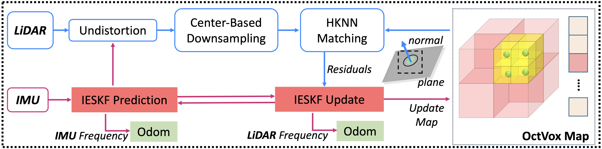

## Overview

<p align="center">
  
</p>

**Key Features:  Efficient · Robust · Cross-Platform Compatible · Supports Both ROS1/ROS2 Versions**

Super-LIO is a robust and efficient LiDAR–Inertial Odometry (LIO) system designed for real-time and large-scale autonomous navigation. It introduces a compact and structured mapping strategy that enables predictable correspondence search and stable state estimation. The system is validated through extensive real-world experiments and comparisons with state-of-the-art methods, which demonstrates that Super-LIO not only achieves **excellent accuracy** but also maintains **lower resource consumption** and realizes a nearly **1.2–4× higher real-time processing speed**⚡.


## Quickly Run with Zvision_lidar

**For ROS1 Users**: Please switch to the **ros1** branch and follow the instructions at [ros1 branch](https://github.com/ZVISION-lidar/Super_LIO_ZVISION/tree/ros1)

### Requirements

Ubuntu 24(22).04 · C++20 · ROS Jazzy(Humble) · Eigen · PCL 

### Dependencies

glog · TBB

```bash
sudo apt install libgoogle-glog-dev libtbb-dev
```

### Build & Run
```bash
git clone https://github.com/ZVISION-lidar/Super_LIO_ZVISION.git
cd Super-LIO
colcon build

source install/setup.bash
ros2 launch super_lio zvision.py

```

#### 🔁 Relocalization Mode
Super-LIO supports relocalization using a pre-built map, allowing the system to resume localization from a saved map without restarting the mapping process.
This mode is useful for long-term deployment, repeated missions, or recovery after tracking loss.

Before running relocalization, please make sure that:
- A map has been previously saved to disk.

```bash
cd PATH_2_Super-LIO
source install/setup.bash
ros2 launch super_lio relocation.py
```
