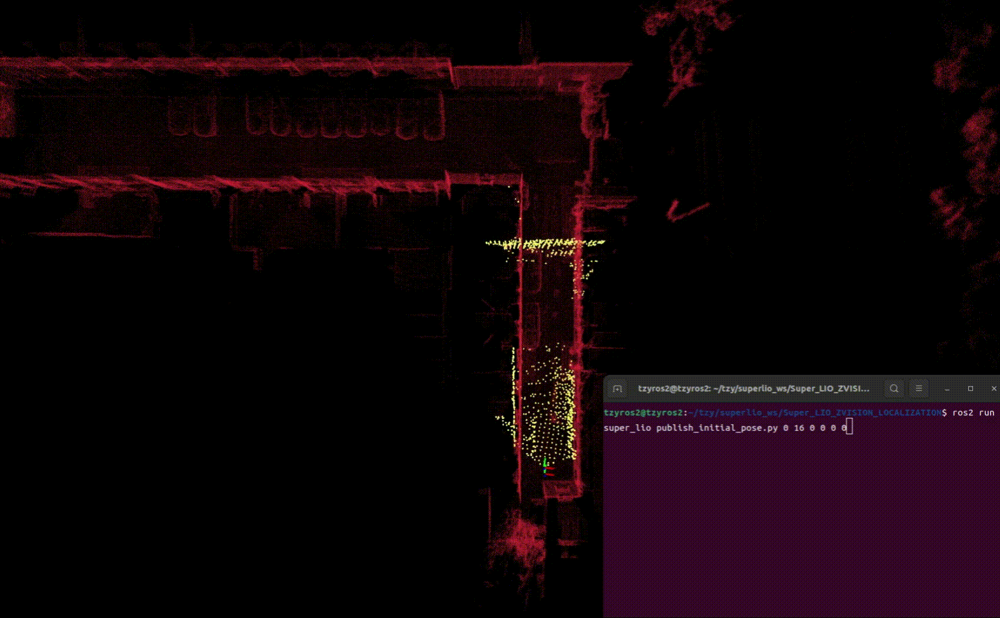

# Super_LIO_ZVISION_LOCALIZATION-ROS2 

Super_LIO_ZVISION  Relocalization Version with Prior Map 

<p align="center">
  
</p>


## 1. Requirements

### 1.1 Ubuntu  ROS2

Recommended environment:

```text
Ubuntu 22.04
ROS2 Humble
```

### 1.2 System Requirements

```bash
sudo apt install libgoogle-glog-dev libtbb-dev
sudo apt install libpcl-dev libeigen3-dev
sudo apt install ros-humble-pcl-ros ros-humble-pcl-conversions
sudo apt install ros-humble-tf2-ros ros-humble-sensor-msgs-py
```

### 1.3 Python Requirements

```bash
pip3 install --user numpy==1.24.4 scipy==1.10.1 scikit-learn
pip3 install --user open3d==0.18.0
```

## 2. Build

```bash
git clone -b relocalization_ros2 https://github.com/ZVISION-lidar/Super_LIO_ZVISION.git
cd Super_LIO_ZVISION
colcon build
```


## 3. Relocalization Run with Prior Map

### 3.1 ros2 launch Relocalization node 

```bash
source install/setup.bash
ros2 launch super_lio localization_zvision.launch.py map:=/path/to/yourself.pcd
```

### 3.2 ros2 launch publish_initial_pose node  to publish an initial pose  (roll pitch yaw : /rad)

```bash
source install/setup.bash
ros2 run super_lio publish_initial_pose.py x y z roll pitch yaw
```

### 3.3 ros2 bag play a ros2bag data or run zvision—sdk

```bash
ros2 bag play /path/to/bag 
```


## 4. Important Topics and Frames

Frames:

```text
map          prior map frame
world        Super-LIO local odometry world frame
imu         Super-LIO body frame
```

Main topics:

```text
/map                 prior globle map
/lio/odom            Super-LIO odomrtry in "world" frame  
/localization        global localization odomrtry in "map" frame 
/cur_scan_in_map     current scan visualization in "map" frame
/path_in_map         path trajectory of /localization
```

## 5. Key Parameters

Relocalization parameters are in `config/zvision_localization.yaml`：

```text
min_scan_points_fine                    #default 500
transform_smoothing_alpha               #default 0.7
localization.map_voxel_size             #default 0.4
localization.scan_voxel_size            #default 0.1
localization.fitness_threshold          #default 0.95
transform_fusion.publish_frequency      #default 0.5
```


## 6. Notes

`Not match!!!!` means the current ICP fitness score is lower than `localization.fitness_threshold`, so the new global correction is rejected. The warning prints the candidate transform and score for diagnosis, but it is not automatically applied.
